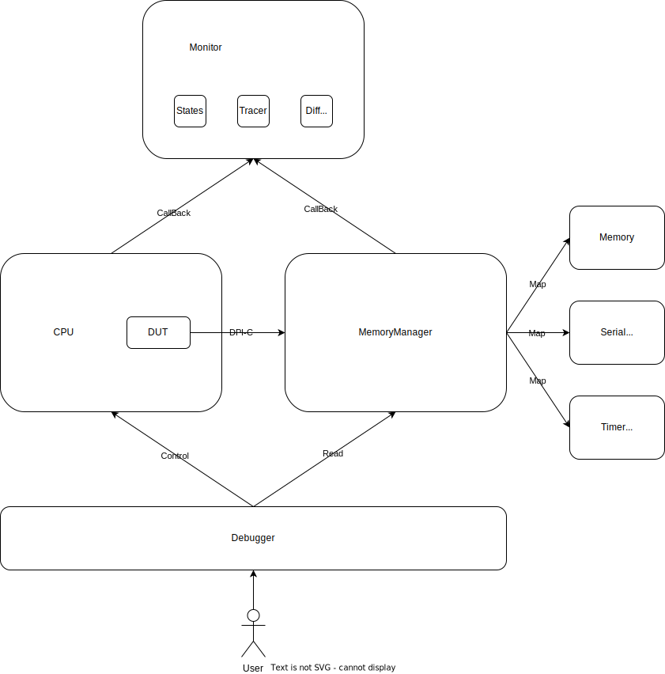

# 一生一芯 C 阶段总结

我认为 NEMU 的开发实际是为 NPC 的开发打基础，以及作为 Differential Test Reference，因此仅总结 NPC 的开发。

C 阶段的任务是：构建一个支持 RV32E、异常处理的单周期 NPC，以另外编写的调试器和追踪器，和模拟内存映射设备。

## Debugger & Tracer

根据 NEMU 的开发经验，我使用 C++ 和面向对象思想在 NPC 中实现了 NEMU 的调试器、追踪器。



CPU 内部包含了 DUT，也就是 Verilator 生成的芯片仿真类，封装 DUT 的接口以便外部调用。

MemoryManager 提供了一个映射，Memory 和 Devices 将在 Manager 中注册内存范围映射。DUT 会通过 DPI-C 访问 MemoryManager，Manager 根据请求的范围将访问转交给对应的对象进行处理。

Monitor 会在 CPU 和 MemoryManager 中插入回调函数，在它们执行的重要环节读取信息，记录状态、保存跟踪信息，以及进行 DiffTest。

Debugger 是用户交互的接口，通过命令行控制 CPU 执行，可以添加断点、监视点，以及扫描内存等。

## RV32E

> RV32E and RV64E are reduced versions of RV32I and RV64I,
 respectively: the only change is to reduce the number of integer registers to 16.

我的 RV32E 处理器架构以及信号基本参照 [NJU-DLCC 实验](https://nju-projectn.github.io/dlco-lecture-note/)。



## Device

由 C++ 模拟，MemoryManager 在对应地址被读取前和写入后会调用 Device 注册的回调函数请求处理。

## CSR

仅需要 4 个 CSR 寄存器和 4 条指令就可以完成异常处理。

CSR:

- mtvec: ecall 指令跳转到的地址。
- mepc: ecall 指令时的 PC。
- mstatus: 其实并不需要，为了通过 DiffTest，需要将 MPP 设置为 M 模式。
- mcause: 其实并不需要，为了通过 DiffTest，需要在异常时设为 0xb(来自 M 模式的 ecall)。

指令：

- ecall: mepc 设置为当前 PC，设置好 mcause，跳转到 mtvec。
- mret: 跳转到 mepc。
- csrrw: 读取一个 CSR 到 rd，rs1 写入到这个 CSR。
- csrrs: 读取一个 CSR 到 rd，rs1 或到这个 CSR。

## AM & klib

现在有了一个可以执行指令的处理器，可以为它编写程序在上面运行了。

但是为它编写程序和正常的开发不太一样，比如说 C 语言的 main 函数执行之前 sp 未定义，那么就会将栈数据放在不该放的地方；ra 未定义，main 函数结束的 return 就会将 PC 跳转到一个未定义的地方。为了处理好这些事情，我们需要一些代码来包裹编写的程序，也就是由另外的一些程序来设置好运行前的环境，调用我们编写的程序，处理它运行后的环境，这就是运行时 Runtime。

> 调试器、追踪器不是运行时，NPC 跑在它们之上，而运行时跑在 NPC 之上。

AM 中的 TRM(Turing Machine) 就是一个直接基于指令集的裸机运行时环境，做好了刚才提到的事情。

现在我们能编写一些简单的运算程序 (am-kernels/tests/cpu-tests) 并通过返回值验证实现的正确性了。但如果要输出，我们需要自己写入内容到 NPC 指定的串口地址。如果我们希望把其它的 C 代码拿来可以直接在 NPC 上跑，就要避免写针对于 NPC 的代码。

为此，AM 面向 NPC 进行封装，提供了如 TRM 中的 putch 等函数。而 klib 则面向 AM 编写了一些仿 C 标准库的函数，这下可以直接 printf 了！另外 AM 提供了 IOE(I/O Extension) 以支持设备访问，也可以将它们封装在 klib 里提供更多类 C 标准库功能，如 time。

> 为什么不直接 klib 面向 NPC？因为 AM 希望支持多种架构，它提供多种架构的最小抽象，而由 klib 基于 AM 编写高级函数。

## Exception & Context

> 我没太分清 exception, trap，进程，线程等概念，学了操作系统之后大概会理解。

### NPC

异常的核心指令和寄存器：

ecall: mepc 设置为当前 PC，跳转到 mtvec
mret: 跳转到 mepc

### AM

根据这两条指令，AM 构建了上下文扩展 CTE(Context Extension)

#### cte_init

首先有 `cte_init` 函数，它将 mtvec 设置为 `__am_asm_trap`，并且接受用户提供的函数指针参数保存到本地变量 `__am_irq_handle`，它会在 trap 时被调用，以允许用户对上下文进行自定义操作。

#### yield

`yield` 函数是用户自陷函数，由用户主动调用，切换到内核线程。其实内部就是 `asm(ecall)`。

> yield 的 ecall 前还有一句 `li a5, -1;`，这是模仿 Linux 的系统调用号传递约定，其实不会被用到。

#### __am_asm_trap

调用 yield 后 ecall 会将我们跳转到 `__am_asm_trap`，它在 trap.S 用汇编编写。它首先将所有 GPR, CSR 寄存器（x0 除外，它总是 0；sp 除外，它还要用，且数据出栈则自然恢复）按照一定次序入栈，那么**现在 sp 所在的位置是 yield 用户线程栈空间中，指向刚刚存入的上下文**。

然后把 sp 复制给 a0 作为参数，调用 `__am_irq_handle`，即用户在 `cte_init` 保存的函数，这个函数会返回一个值在 a0，把这个返回值存入 sp。**现在 sp 所在的位置应当是刚刚返回的用户线程栈空间中，且应当指向一个上下文**，它可以和原来的上下文完全不同。然后把上下文出栈，存入寄存器。

最后 mret，转到 mepc。

```asm
PUSH ALL REGS
mv a0, sp               # 现在 sp 所在的位置是 yield 用户线程栈空间中，指向刚刚存入的上下文
call __am_irq_handle    # 上下文切换的关键节点
mv sp, a0               # 现在 sp 所在的位置应当是刚刚返回的用户线程栈空间中，且应当指向一个上下文
POP ALL REGS
mret
```

#### kcontext

虽然 `yield` 函数可以做到上下文切换了，但是哪来这么多线程、栈空间和上下文呢？`kcontext` 可以让你创造一个。

它接收 3 个参数：栈底指针、要运行的函数指针、要运行的函数参数。它的工作就是，在栈底申请一块内存放入上下文，这个上下文的 mepc 设为函数指针 - 4，就**好像**它之前是一条 ecall；另外把 a0 设为函数参数。最后返回这个栈中的上下文指针。

如果 `__am_irq_handle` 把一个 `kcontext` 生成的指针返回给 `yield`（记得给 mepc + 4），那就可以完美跳转到当时 `kcontext` 指定的函数了。

> 还记得运行时中提到的 sp 和 ra 未定义吗？kcontext 创建的上下文只定义了 sp，没有定义 ra，所以由 kcontext 创建的函数是不能 return 的，但可以 yield 后再也不返回，或许被销毁。

### 用户程序

用户只需要开一个线程池，或是 am-kernels/kernels/yield-os 管它叫 PCB(Process Control Block)，在里面放一堆 kcontext，在自己要执行的函数里放好 `yield`，写一个调度函数传给 `cte_init`，就可以看到自己的函数在轮流执行了。

实验证明，这个简单的异常处理和上下文切换，就可以运行 RT-Thread 操作系统了。
